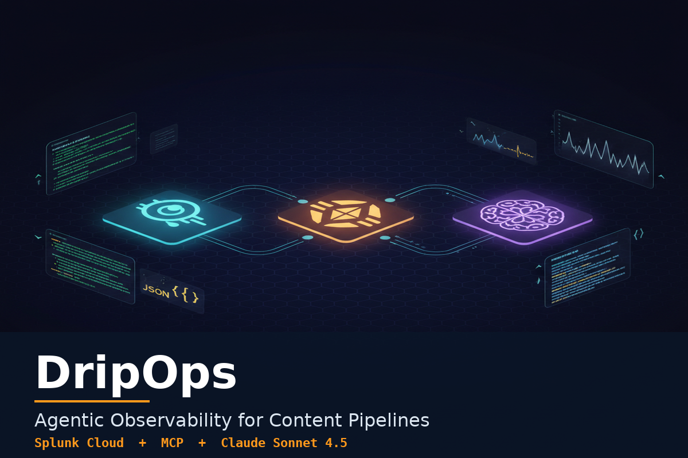
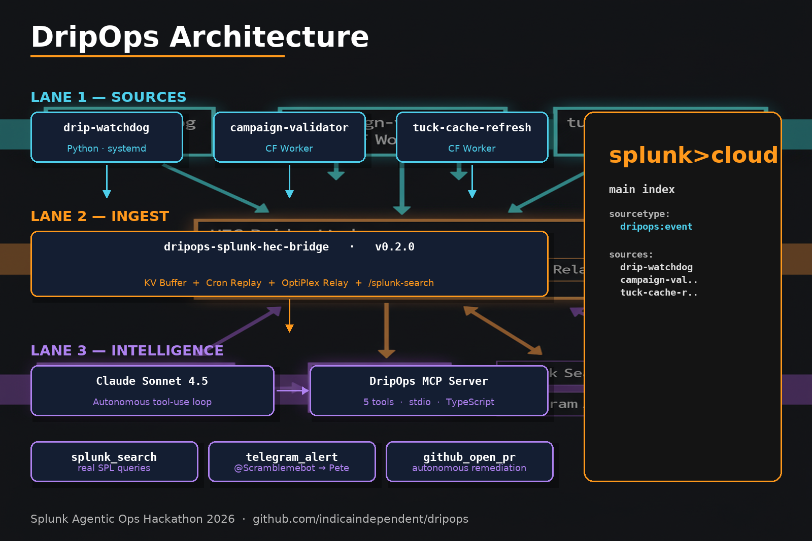
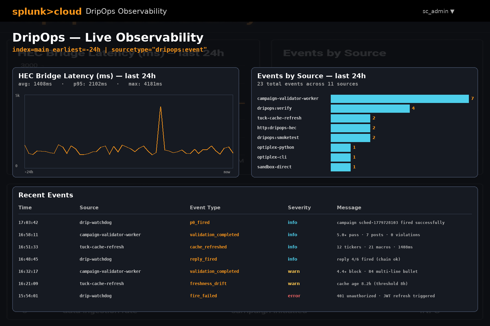

# DripOps

> **Agentic Observability for Content Pipelines**
> Built for the [Splunk Agentic Ops Hackathon 2026](https://splunk.devpost.com).

<p align="center">
  
</p>

[](./LICENSE)
[](./workers/splunk-hec-bridge)
[](./agent/mcp-server)
[](./agent/claude-agent)

---

## TL;DR

DripOps is a three-lane agentic observability stack:

1. **Sources** — Python and Cloudflare Worker services emit typed events.
2. **Ingest** — one Cloudflare Worker (`dripops-splunk-hec-bridge`) validates, buffers, and ships them to Splunk Cloud via HEC, with a SSH-MCP relay fallback.
3. **Intelligence** — a Model Context Protocol server exposes 5 tools to Claude Sonnet 4.5, which reads runbooks, queries Splunk, and acts (Telegram alerts or GitHub PRs) when patterns match known incidents.

It's running on the author's production content pipeline right now. Real events. Real Splunk. Real Telegram alerts.

---

## Architecture

<p align="center">
  
</p>

### Lane 1 — Sources

| Service | Runtime | Emits |
|---|---|---|
| `drip-watchdog` | Python · systemd | `p0_fired`, `reply_fired`, `fire_failed` |
| `campaign-validator-worker` | Cloudflare Worker | `validation_completed` (with stars + violations) |
| `tuck-cache-refresh` | Cloudflare Worker | `cache_refreshed`, `refresh_failed`, `freshness_drift` |

All sources use the same helper signature:

```python
emit_dripops_event(source, event_type, severity="info", **fields)
```

```typescript
ctx.waitUntil(emitDripops(env, { source, event_type, severity, ...fields }));
```

### Lane 2 — Ingest

`workers/splunk-hec-bridge/` — one Cloudflare Worker that:

- Validates every event against a strict JSON schema
- Buffers to Cloudflare KV when Splunk is unreachable (cron-drains every 5 min)
- Falls back to an OptiPlex SSH-MCP relay when direct HEC is blocked by strict cert validation
- Exposes `/event`, `/batch`, `/replay`, `/splunk-search`, and `/splunk-saved-search`

### Lane 3 — Intelligence

`agent/mcp-server/` — TypeScript MCP server, stdio transport, 5 tools:

| Tool | What it does |
|---|---|
| `dripops_health` | Reads the bridge `/health` endpoint and last latency |
| `splunk_search` | Routes raw SPL via the bridge → relay → Splunk |
| `splunk_saved_search` | Dispatches a Splunk saved search by name |
| `telegram_alert` | Sends a message to the configured chat |
| `github_open_pr` | Opens a draft PR against the configured repo |

`agent/claude-agent/` — Python orchestrator that loads runbooks as the system prompt, spawns the MCP server, and runs Claude Sonnet 4.5 in a tool-use loop.

---

## Live proof

Real Splunk Cloud, real `dripops:event` sourcetype, real cross-runtime events:

<p align="center">
  
</p>

> 23 events across 13 distinct `(source, event_type)` tuples in a 24-hour window from one saved search.

---

## Quick start

```bash
# 1. Clone and install
git clone https://github.com/indicaindependent/dripops.git
cd dripops
cp .env.example .env  # fill in your own values

# 2. Bridge worker (Cloudflare)
cd workers/splunk-hec-bridge
npm install
# set secrets via `wrangler secret put` — see SECURITY.md
wrangler deploy

# 3. MCP server (any host that can run Node)
cd ../../agent/mcp-server
npm install
npm run build
./test/smoke-test.sh

# 4. Claude agent (any host with Python 3.11+)
cd ../claude-agent
pip install -r requirements.txt
python3 agent.py --once
```

---

## Why this design

- **One credential surface.** All Splunk secrets live in the bridge worker. The MCP server only needs the bridge URL plus the ingest key.
- **Fire-and-forget telemetry.** Sources emit via `ctx.waitUntil()` (CF Workers) or a 3-second timeout (Python). User-facing latency stays under 100ms.
- **Saved-search-first.** The agent calls pre-vetted saved searches by name rather than running arbitrary SPL. Real Splunk shops manage SPL through saved reports; this matches that workflow.
- **Runbooks as the system prompt.** Adding a new incident pattern is `touch prompts/runbooks/new_pattern.md`. The agent picks it up on the next run.

See [SECURITY.md](./SECURITY.md) for credential handling and the rotation runbook.

---

## Repo layout

```
dripops/
├── workers/splunk-hec-bridge/    # Lane 2 — Cloudflare Worker ingest
│   ├── src/index.ts              #   v0.3.0 source
│   ├── wrangler.toml             #   deployment config (secrets listed, never set)
│   └── package.json
│
├── agent/mcp-server/             # Lane 3 — MCP server (TypeScript)
│   ├── src/index.ts              #   5 tools, stdio transport
│   ├── test/smoke-test.sh        #   E2E smoke tests
│   └── README.md
│
├── agent/claude-agent/           # Lane 3 — Claude orchestrator (Python)
│   ├── agent.py                  #   tool-use loop, 8-iteration cap
│   ├── prompts/system.md         #   agent persona + safety rails
│   └── prompts/runbooks/         #   one .md per incident pattern
│
├── sources/                      # Lane 1 — instrumented service snapshots
│   ├── campaign-validator-worker.{original,patched}.js
│   ├── tuck-cache-refresh.{original,patched}.js
│   └── splunk-hec-bridge.{v0.2.0,v0.3.0}.js
│
├── patches/                      # Idempotent patcher scripts for sources
│   ├── dripops_watchdog_patch.py
│   └── patch_campaign_validator.py
│
├── docs/                         # Architecture notes, runbook templates
├── assets/                       # Diagrams, logos, devpost images
├── .env.example
├── SECURITY.md
├── LICENSE
└── README.md
```

---

## What's next

- Splunk AI Assistant integration for autonomous SPL generation
- One-call branch + commit + PR via `github_open_pr`
- Multi-tenant runbook directories (bring-your-own runbooks)
- Workers AI (Llama 3.3 70B) cheap-tier triage before Claude escalation
- A Splunk dashboard for the agent's own activity

---

## Credits

Built by [Peter McVries](https://bsky.app/profile/indicaindependent.bsky.social) ([@indicaindependent](https://github.com/indicaindependent)).

Stack: Cloudflare Workers · Cloudflare KV · Splunk Cloud · Anthropic Claude Sonnet 4.5 · Model Context Protocol · TypeScript · Python · Dell OptiPlex · home lab.

License: [MIT](./LICENSE).
